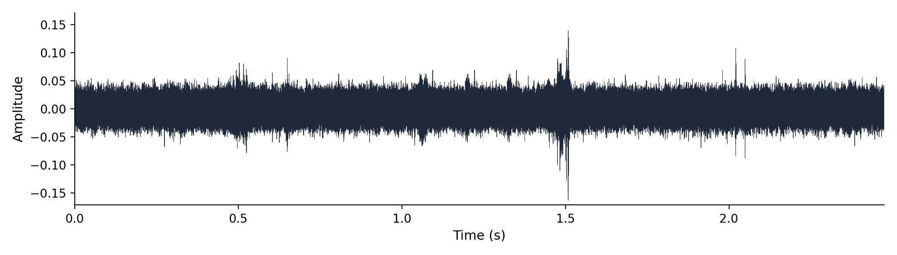

# A Computational Pipeline for Detecting and Quantifying Mouse Ultrasonic Vocalizations: A Tool for Comparing Courtship Vocal Behavior in Laboratory and Wild Mice

**Author:** Shachar

**Supervisor:** Prof. Michael (Mickey) London, Edmond and Lily Safra Center for Brain Sciences (ELSC), The Hebrew University of Jerusalem

**Atgar Final Project — School: [to verify] · Mentor: [to verify]**

2026

---

## Abstract

Mouse courtship is largely expressed as ultrasonic "song" emitted mainly by the male, making systematic quantification of ultrasonic vocalizations (USVs) a natural entry point into the behavior. Yet USVs are invisible in the pressure waveform, live at 20–120 kHz, and are buried in cage noise that shares those bands, while general audio tools are unusable at a 300 kHz sample rate. To ask whether laboratory and wild-derived mice court differently, I first built the measurement instrument that question requires. I developed a CNN-aligned PyQt6 labeling application; trained a convolutional detector (USVClassifierCNN) on raw spectrograms and, across three generations, used hard-negative retraining to convert an over-firing network into a selective one; and wrapped its frame-level probabilities in temperature calibration, false-positive rejection, hysteresis event-stitching, and automated triage so probabilities become trustworthy call events at scale. On a held-out window set (n = 1,829), the detector reached 90.5% precision, 88.5% recall, 96.1% specificity, and ROC-AUC 0.989 — these are window-level, not whole-file, metrics. Applying the pipeline to wild (three dyads) and laboratory (a 17-couple partner-swap assay) cohorts produced two statistically tested acoustic leads: wild calls span a wider bandwidth (per-unit IQR +51%, one-sided Mann–Whitney p = 0.012) and a wider principal-frequency range (+77%, p = 0.012). Yet at the population level wild and lab calls overlap on one shared 32-dimensional call-space manifold, indicating no gross repertoire reorganization. Given a tiny biological sample (3 wild dyads vs 6 lab males) and a known recording-cage confound, these are promising leads, not a proven difference.

---

## 1. Introduction

Mice are not silent animals. When an adult male house mouse encounters a female, he produces a rapid stream of ultrasonic vocalizations (USVs) — brief, frequency-modulated whistles that fall well above the range of human hearing. Holy and Guo (2005) first established that these vocalizations are not random emissions but structured, song-like sequences: they recur in characteristic syllable types and follow temporal patterns reminiscent of birdsong. Subsequent work showed that this song is socially meaningful. Chabout et al. (2015) demonstrated that males vary the *syntax* of their song — the way syllable types are ordered and sequenced — according to social context, and that females prefer certain song structures, establishing USVs as a genuine communicative channel under social control. The temporal organisation of this song is regular enough that it can be exploited to label syllables automatically (Hertz et al., 2020). Mouse courtship behaviour, in other words, is to a large extent *expressed as ultrasonic song*. If we want to understand how a courting pair of mice interacts, a very large fraction of what we can observe is encoded in this acoustic stream — making the systematic quantification of USVs a natural entry point into the behaviour itself.

There is, however, a fundamental measurement problem that stands between the biology and any quantitative claim about it. USVs occupy a frequency band of roughly 20–120 kHz, far above the ~20 kHz ceiling of human hearing and of ordinary audio. In the raw pressure waveform — amplitude plotted against time — a USV is essentially invisible. Figure 1 makes this concrete: a 2.5 s recording contains four genuine USVs, yet the waveform shows nothing an observer could point to, because the waveform encodes total energy over time and not the *spectral structure* that distinguishes a whistle from a click or from silence.

The vocalizations only become visible once the signal is transformed into a spectrogram — a time–frequency image in which the short-time Fourier transform exposes how energy is distributed across frequency at each instant. In a spectrogram (Figure 2), a USV appears as a thin, curved ridge of power sweeping through the 20–120 kHz band, immediately recognisable by eye in a way it never is in the waveform. The spectrogram, then, is the representation in which the question "where are the calls?" can even be asked.

Recovering this spectral structure imposes hard constraints on how the recording must be made and analysed. To represent frequencies up to 120 kHz without aliasing, the Nyquist criterion demands a sample rate of at least 240 kHz; the recordings analysed here are sampled at 300,000 Hz, placing the Nyquist limit at 150 kHz and leaving headroom above the USV band. The detection spectrogram is computed with a short-time Fourier transform of length n_fft = 512 samples and hop = 128 samples (75 % overlap), which favours time resolution over fine spectral detail — the right trade-off for short, narrow-band calls whose onsets and offsets must be captured crisply (the exact resolution figures are given in §5.2). These constants are not arbitrary: a shorter analysis window buys finer time resolution at the cost of coarser frequency resolution, and USVs reward favouring time resolution. The constants are defined once, in code, and imported everywhere downstream so that every module sees the same physical grid; the detector is locked to this 20–120 kHz, 256-row representation and would have to be retrained if the band were changed.

Doing this reliably *at scale* is where the difficulty compounds. A real cage recording is not a clean signal with a few whistles in it. The animals move, scratch, and scuffle; ventilation hums; the cage hardware rattles. Many of these sounds are broadband — they deposit energy across a wide span of frequencies, including the 20–120 kHz USV band itself — so a simple amplitude spike is just as likely to be a paw-scuff as a vocalization. Figure 2 shows exactly this overlap: vertical broadband streaks from cage activity cut straight through the band where the calls live, and no amount of thresholding on loudness alone can separate the two.

Compounding the problem, general-purpose audio software is simply unusable here. A tool such as Audacity is built around human-audible audio sampled at tens of kilohertz; confronted with a 300 kHz recording it cannot display, scrub, or analyse the signal in any meaningful way (Portfors, 2007). There is no off-the-shelf application into which one can load these files and start counting calls. The combination — invisible-in-the-waveform calls, broadband cage noise sharing their band, and the absence of usable general tools — means that quantifying USVs at the scale of thousands of calls per recording requires building purpose-made instrumentation.

This challenge has been recognised, and several automated approaches now exist. DeepSqueak (Coffey et al., 2019) reframed USV detection as an object-detection problem on the spectrogram image, applying a deep network to draw bounding boxes around candidate calls. VocalMat (Fonseca et al., 2021) combined computer-vision segmentation with a convolutional classifier to detect and categorise calls from spectrogram images. AMVOC (Stoumpou et al., 2022) and BootSnap (Abbasi et al., 2022) added further detection-and-analysis toolchains, the latter targeting robust detection in noisy recordings. Goffinet et al. (2021) took a different tack, learning low-dimensional feature spaces with a variational autoencoder to quantify whole vocal repertoires and group differences without committing to a fixed syllable taxonomy. Each of these advanced the field substantially. Yet adopting any of them wholesale for the present question left a gap: I needed a pipeline whose every signal-processing constant, model checkpoint, and post-processing threshold was fixed, documented, and reproducible on *these* recordings — one whose frame-level probabilities I could trust enough to convert into call counts and acoustic measurements that would survive statistical scrutiny. That requirement — a reproducible, end-to-end measurement instrument tuned to this lab's 300 kHz cage recordings — is what motivated building a purpose-built pipeline rather than reusing an existing one as a black box.

The biological question that pipeline was built to serve is a comparative one: *is there a difference in courtship behaviour between laboratory and wild mice, and if so, what is it?* Laboratory mice are highly inbred and have been bred for generations under conditions unlike anything their wild-derived relatives experience, and it is far from obvious whether their courtship vocal behaviour still resembles that of wild animals. The lab records both kinds of couples in modified Live Mouse Tracker (LMT) cages, with a 300 kHz microphone overhead and a camera below, precisely so that this comparison can be made on matched apparatus. The contribution of this thesis is, accordingly, a hybrid one: the detection pipeline itself is the primary deliverable, and applying it to wild (three dyads) and laboratory (a partner-swap assay) cohorts yields statistically-tested *leads* — wild calls are acoustically more variable — while both groups nonetheless fill the same call-space, so these remain promising leads, not a proven difference. In short, this thesis builds a measurement tool in order to make the biological question answerable.

## 2. Research Question and Objectives

The central question driving this work is: **"Is there a difference in courtship behavior between laboratory and wild mice? And if so, what is it?"** Mouse courtship is largely conducted through ultrasonic song, emitted mainly by the male (Holy & Guo, 2005). Answering this question objectively requires quantifying thousands of calls reproducibly — yet, as Section 1 established, USVs are invisible in the pressure waveform, live at 20–120 kHz, and are buried in cage noise that shares those bands, so general audio tools cannot be used at a 300 kHz sample rate (Portfors, 2007). Building the measurement instrument is therefore the necessary first step and the main contribution; the biological question is the spine that organizes it. My objectives were to:

- **Build a Python-native, CNN-aligned labeling and visualization tool** usable at 300 kHz, to create and inspect USV labels (Figure 3).
- **Train and validate a convolutional neural network detector** that is selective in noisy cage recordings, via hard-negative retraining across three detector generations (Figures 4, 5, 7).
- **Wrap the detector in a calibrated, false-positive-resistant, scalable pipeline** with hysteresis and human-review triage, turning frame probabilities into trustworthy call events (Figure 6).
- **Apply the pipeline to wild (three dyads) and lab (partner-swap) cohorts** to test for a courtship vocal-behavior difference (Figures 8–10).

The honest result, developed across the Results that follow, is promising leads, not a proven difference. The Results are organized to mirror that build order: a labeling substrate (3.1), the detector and its calibration (3.2, 3.3), the scaled pipeline (3.4), and finally the biological application (3.5).

## 3. Results

### 3.1 A purpose-built labeling and visualization tool

How do you produce and inspect trustworthy USV labels at 300 kHz when general-purpose audio tools fail? Every later component — the detector, its calibration, the lab-versus-wild comparison — rests on a ground-truth set of human-confirmed calls. Yet a USV is invisible in the pressure waveform (Figure 1), it lives at 20–120 kHz, and real recordings are dominated by cage activity, ventilation and paw-scuffs whose broadband streaks overlap that same band (Figure 2). General audio editors such as Audacity cannot usefully render or scrub a 300 kHz stream: the workflow I started with was effectively unusable for marking calls at this sample rate. I therefore needed a labeling substrate that an annotator could trust frame-by-frame, and — critically — that showed the human exactly what the detector would later see.

My strategy was to build the labeling and review environment in Python rather than wrap a foreign tool, so the spectrogram, the sample rate, and the analysis band are the *same* objects the rest of the pipeline imports. The result is a PyQt6 desktop application (`scripts/run_app.py`). It presents three vertically stacked panels: a 20–120 kHz spectrogram with each detected USV's boundaries drawn on it, a 0–30 kHz sonic panel for audible context, and a CNN-probability panel carrying onset and sustain threshold lines (Figure 3). The canonical constants — 300 kHz sample rate, the 20–120 kHz band — are imported from a single source (`corpus.py`), so the view cannot silently drift from what the network was trained on.

The workflow is per-detection and direct: the operator opens a WAV, runs detection, then for each candidate may drag a boundary, add a detection by hand, or delete a false one; every edit is recorded with `user_adjusted` / `user_action` metadata so a hand-correction is never confused with a raw machine output. Threshold presets and live arrow-key nudges (0.01 in probability units) let the annotator tighten or loosen the onset/sustain gates and immediately see the interval set update. When a whole recording is just noise, a single *Label File as Noise* flag triages it without forcing per-call work. The interactive view's defaults (onset 0.60, sustain 0.40) are deliberately aligned to the offline batch hysteresis so what the human inspects matches the production detector's output; the app's *Detect* runs CNN + hysteresis only, deliberately omitting the false-positive filter and temperature calibration that belong to the offline pipeline — a two-path distinction examined in full in Section 3.3.

What the tool records is a per-WAV JSON label file: a metadata header (WAV path, model checkpoint, duration, sample rate), the detection parameters, one object per USV with its start/end times, spectrogram columns and CNN probabilities, plus the full probability trace so reopening a file reconstructs the exact view. These hand-labels are not an audit by-product; they are the training signal for the detector described next. The hard-negative and hard-positive examples that turned an over-firing network into a selective one were marked in precisely this environment, with the annotator looking at the same 256-row, 20–120 kHz spectrogram the CNN consumes. In short, the purpose-built tool replaced an unworkable Audacity-based workflow with a CNN-aligned one whose JSON output flows straight into model training — the first link in making thousands of calls measurable, objectively and reproducibly.

### 3.2 A convolutional detector for USVs in raw recordings

The labeling tool gave me a way to make and inspect labels, but the central engineering problem remained. The sub-question for this section is concrete: **can a convolutional neural network detect USVs directly from spectrograms, despite cage noise that overlaps the call band?** As in §3.1, the obstacle is that a USV is invisible in the waveform (Figure 1) and shares its 20–120 kHz band with ventilation, paw-scuffs and bedding rustle (Figure 2), so energy thresholding alone cannot separate calls from noise.

My strategy was to treat detection as a sliding-window image-classification problem. Rather than hand-engineer features or threshold the spectrogram energy — which fails precisely because noise and calls share an energy band — I trained a small convolutional network to look at a short spectrogram window and output a single probability that the window contains a USV, then slid that window across the whole recording to produce a per-window probability trace. The detection spectrogram is computed on the locked corpus grid (sample rate 300,000 Hz; STFT n_fft = 512, hop = 128; resolution figures in §5.2). Restricting the analysis to the 20–120 kHz band keeps the detector inside the frequency range where mouse song actually lives (Holy & Guo, 2005; Portfors, 2007) while leaving headroom below the 150 kHz Nyquist limit. These constants are defined once in code and imported everywhere; the detector is locked to this exact 20–120 kHz / 256-row grid and must be retrained if the band ever changes.

The architecture is shown in Figure 4. The network — `USVClassifierCNN` — takes a single grayscale spectrogram window of 256 frequency rows by 100 time columns (~43 ms of audio) and passes it through three convolutional blocks. Each block is a 3×3 convolution (padding 1) followed by batch normalization, a ReLU nonlinearity, and 2×2 max-pooling; the three blocks use 32, 96, and 192 filters and progressively halve the spatial resolution (256×100 → 128×50 → 64×25 → 32×12). The 192 feature maps are then collapsed by global average pooling into a single 192-dimensional vector, which feeds a compact classifier head: `Linear(192→64)`, ReLU, dropout (0.5) for regularization, and a final `Linear(64→1)` producing one logit. A sigmoid converts that logit into P(USV).

The convolution-then-pool design follows the standard convolutional lineage for image recognition (He et al., 2016); the global average pool is what lets a window-trained classifier slide cleanly across time without a fixed-length flatten layer. This is a deliberately small network — far smaller than the ResNet-scale classifiers used downstream — because the detection task is binary and the input is a tiny, single-channel patch.

Two pre-processing choices are essential to making this work, and both follow directly from the noise problem. First, **global MAD normalization.** Before any windows are cropped, the entire spectrogram is normalized once, not window by window. I take the median and the median absolute deviation (MAD) of the whole spectrogram, clip it to `[median − 2·MAD, median + 4·MAD]`, and rescale that range to [0, 1]. Normalizing globally preserves the *relative* energy structure of the recording — quiet regions stay quiet and loud USV regions stay loud — so the network sees a genuinely high-contrast call against the noise floor. Per-window normalization (the tempting but wrong alternative) rescales every patch independently and silently destroys high-confidence USVs by stretching the noise floor of an otherwise-quiet window up to full contrast. The clip-before-normalize order must also match the order used when the training spectrograms were rendered; any mismatch shifts the input distribution the network was trained on. Second, an **energy pre-gate.** Windows whose maximum normalized energy falls below a small threshold skip the CNN entirely and are assigned probability zero. This is a pure efficiency step — it avoids running the network on the vast stretches of genuinely empty recording — and it is one of the few places the two detection paths deliberately differ (gate 0.1 in the batch pipeline versus a more conservative 0.35 in the interactive app).

The architecture above defines *what* the detector is; the evidence that it actually *detects* calls — and detects them selectively — comes from running three detector generations on the same recording (Figure 5, examined in §3.3). Figure 6 shows the production detector at work on a 2.5 s clip: the top panel is the 20–120 kHz spectrogram with four detected USVs shaded, and the bottom panel is the sliding-window CNN probability trace, which rises sharply over each true call and stays near zero over the intervening noise.

The probability trace is the raw material for everything that follows — but a raw frame-by-frame probability is not yet a trustworthy *call event*, and the first detector I trained was far from selective. Turning this probability trace into reliable, countable USV events, and showing how successive detector generations were made selective, is the subject of the next section.

### 3.3 Calibrating the detector and making it trustworthy at the event level

A detector that fires on real USVs is necessary but not sufficient. The sub-question here is: **how do I make the detector selective against cage noise, and how do I turn a noisy frame-by-frame probability trace into trustworthy, countable call events?** Getting "fires on USVs" was easy; getting "fires on USVs *and not* on cage-noise streaks" took three generations of training.

Figure 5 (introduced in §3.2) tells that story by scoring three detector generations on the *same* 3.6 s recording. The first CNN (v1) was under-sensitive: it produced only **1 detection**, missing real calls. My response — retraining on more matched windows — overcorrected. The "matched" detector (v2) produced **17 detections** on that same clip, over-firing on cage-noise streaks that happened to share the call band. The fix was **hard-negative retraining**: I mined the windows where v2 fired on noise, added them to the training set as explicitly-labeled negatives (620 hard negatives plus 144 hard positives), and retrained. The resulting production model (hard-neg, v3) produced **4 detections** on the same recording — selective, flagging the real calls without chasing every noise streak. (These per-generation counts are illustrative of one 3.6 s clip, read directly from the figure; the qualitative pattern — under-sensitive → over-firing → selective — is the documented, reproducible result.)

Hard-negative retraining is what turned an over-firing detector into a discriminating one; it is the single most important training decision in the detection core, and it works because the hardest negatives are exactly the noise patterns that look most like calls.

I then measured the production detector on a held-out test set. On **n = 1,829 windows**, it achieved accuracy **93.9%**, precision **90.5%**, recall **88.5%**, and specificity **96.1%**, with a confusion matrix of 479 true positives, 50 false positives, 1,238 true negatives, and 62 false negatives (Figure 7a). The ranking quality is strong: ROC-AUC **0.989** (Figure 7b) and PR-AUC / average precision **0.974** (Figure 7c).

I want to be explicit about what these numbers are and are not: **they are window-level (patch-level) classification metrics, not whole-file detection rates.** They report how well the network labels an individual 256×100 spectrogram window, not how many true calls survive the full event-level pipeline on a complete recording. Whole-recording behavior depends on the post-processing below, and the three-generation detection counts in Figure 5 are the better illustration of real selectivity.

Three post-processing stages convert the probability trace into trustworthy call events. First, **temperature calibration** (Guo et al., 2017): the network's logits are divided by a fitted temperature, T = **0.902**, before the sigmoid. Because T < 1, this slightly sharpens the probabilities and modestly improves calibration (negative log-likelihood 0.16908 → 0.16809). The transform is monotonic, so it leaves the ROC and AUC unchanged — it fixes *calibration*, the meaning of a probability value, not *ranking*, the ordering of windows. Calibration matters because the next stage applies fixed numerical thresholds.

Second, **hysteresis** converts the per-window probability trace into discrete intervals. An event is seeded only when the probability rises above an onset threshold of **0.60**, then grown outward while the probability stays above a lower sustain threshold of **0.40**, and finally kept only if it spans at least 3 windows. The two-threshold scheme — a high gate to start, a lower gate to continue — is what prevents a single noisy frame from either spawning a spurious event or fragmenting one real call into several. These production thresholds were selected by cross-validation (mean F2 = 0.867 ± 0.051) and are deliberately different from the library defaults (onset 0.75 / sustain 0.40 / min-duration 5).

Third, a **false-positive (FP) filter** does a second-stage USV-versus-noise decision on each surviving event. It is a class-balanced logistic regression over 11 per-event features (a `StandardScaler → LogisticRegression` pipeline; its single most important feature is the event's peak probability), trained specifically to reject the noise events that pass hysteresis. Its measured cost is small and favorable: it keeps **~87.3% of ground-truth USVs** (an interval-level loss of ~7.67%) while rejecting **100% of noise-only files** and **~64% of in-recording false positives**. Earlier sessions wrongly reported this filter as discarding ~70% of USVs by confusing event-level with interval-level accounting; the corrected interval-level figure is the one to cite. On top of these stages, a triage step sorts each recording into auto-accept (every event peak ≥ 0.90), auto-reject (no events, or maximum probability ≤ 0.10), or manual review, attaching quality-control flags (e.g. high noise floor, excessive event count, over-long events) so a human reviews exactly the ambiguous recordings and no more.

Finally, one operational distinction must not be conflated, because conflating it has caused real bugs. There are **two detection paths**. The interactive desktop app's "Detect" applies the **CNN plus hysteresis only**, on raw (uncalibrated) probabilities with the conservative 0.35 energy gate — it is the tool for visual inspection (Figure 3). The offline **batch pipeline** adds the full chain: temperature calibration, the FP filter, and triage, and is the path used to process whole cohorts at scale (§3.4). Mixing them is a known failure: applying the batch FP filter inside the app context once wrongly suppressed real detections (8 → 0 on one file), because the filter assumes the calibrated, full-pipeline context it was trained in. Keeping the two paths distinct is what makes the detector both interactively inspectable and trustworthy at scale — and the next section uses that batch path to process entire cohorts.

### 3.4 Running the pipeline at scale with human-review triage

Detector metrics establish that the CNN is trustworthy on individual windows, but a courtship study needs whole cohorts processed identically and at scale. My sub-question here was practical: **how do I process entire cohorts reproducibly while keeping human attention on the recordings that actually need it?**

The strategy was a single-command batch runner, `scripts/run_batch_detection.py`, that takes a directory of WAV files and emits one detection JSON per recording plus a `summary.parquet` triage table. The command requires five model-related flags — the CNN checkpoint, the temperature-scaling file, the false-positive-filter pickle, the fitted hysteresis configuration, and the worker count. This is deliberate. The script will run with only the model and an output directory, but omitting any of the other artifacts silently degrades the result: without temperature the probabilities are over-confident and the triage tiers drift; without the FP-filter the detection list is bloated with in-recording false positives; without the hysteresis configuration the detector falls back to library defaults (onset 0.75 / sustain 0.40 / min-duration 5) instead of the production-tuned values (onset 0.60 / sustain 0.40 / min-duration 3). I therefore treat all five flags as mandatory, and a run missing the FP-filter or hysteresis configuration is an incomplete pipeline whose triage I do not report as a production result. This offline batch path is *not* the same as the desktop app's "Detect" (the two-path distinction, §3.3); the two paths do not produce identical detections and I never conflate them.

The triage step is what keeps human review tractable. Each recording is sorted into one of three tiers from its event probabilities: a recording is **auto-rejected** if it has no events or its maximum window probability is at most 0.10; it is **auto-accepted** only if *every* event peaks at probability ≥ 0.90; everything in between is sent to **manual review**. On top of the tier, each recording carries quality-control flags — a high noise floor (90th-percentile window probability > 0.4), a high event count (> 10), an over-long event (> 600 ms), or an event spanning most of the recording — which both promote borderline files to review and let me audit the cohort for systematic problems. The net effect is that confident detections and confident rejections are dispositioned automatically, and a human looks only at the genuinely ambiguous minority.

I ran this pipeline on four cohorts. The wild-derived recordings comprise three dyads — 5970, 3452, and 9252 — each of which is a single wild mouse couple (one male, one female), so each wild cohort is statistically N = 1 couple and cross-dyad differences are a between-animal noise floor rather than a strain effect. The laboratory cohort 131204 is a 17-couple partner-swap assay. After detection and DeepSqueak classification the matched-call counts were 7,921 for 5970, ~401 for 3452, ~604 for 9252, and 40,787 for the clean lab table — tens of thousands of objectively measured calls produced by one reproducible command per cohort. With these measured calls in hand, I could finally turn the instrument on the biological question.

### 3.5 Applying the pipeline: do lab and wild mice court differently?

With the pipeline producing tens of thousands of measured calls, I could finally ask the thesis's central question. Each detected call was passed through the DeepSqueak bridge, which re-renders the call's spectrogram and extracts per-call acoustic features with DeepSqueak's `CalculateStats` — including the call's **bandwidth** (the box's Delta Freq) and its **principal frequency** (the dominant frequency of the call's tonal ridge). These two features let me ask whether wild and lab calls differ in their acoustic spread. I report the answer as three deliberately hedged sub-results, and I want to be explicit up front that I treat them as *promising leads, not a proven difference*.

**(a) Wild calls span a wider bandwidth.** My first sub-question was whether wild calls vary more widely in bandwidth than lab calls. The strategy was to compute, per biological unit, the interquartile range (IQR) of call bandwidth — the spread of the middle 50% of that unit's calls — and then compare wild against lab. The unit of analysis matters: I used three wild dyads (5970, 3452, 9252) and six lab males (m1–m6, each male's calls pooled across the couples in which he was the vocalizer), giving N = 3 wild versus N = 6 lab. I tested the difference with a one-sided Mann–Whitney U test (wild > lab) and confirmed it with an exact permutation test over all 84 possible 3-versus-6 splits. The result was a clear lead: mean per-unit bandwidth IQR was 42.4 kHz in wild versus 28.1 kHz in lab (a +51% wider spread in wild), Mann–Whitney U one-sided p = 0.012, exact permutation p = 0.012 (Figure 8). With N = 3 versus N = 6, the wild and lab units separated perfectly in rank — but perfect rank separation is the *most* a test on nine aggregate values can show, and it is exactly what produces the floor p ≈ 0.012; it is a ceiling on what is knowable here, not evidence of deep statistical power.

**(b) Wild calls span a wider principal-frequency range.** My second sub-question applied the identical logic to principal frequency: do wild calls occupy a wider band of carrier frequencies? Using the same units (3 wild dyads, 6 lab males) and the same one-sided Mann–Whitney U plus exact permutation test, the per-unit IQR of principal frequency was 23.0 kHz in wild versus 13.0 kHz in lab — a +77% wider spread in wild — with Mann–Whitney U one-sided p = 0.012 and exact permutation p = 0.012 (Figure 9). As with bandwidth, the wild and lab unit sets separated perfectly in rank, which is again the ceiling these tiny-N tests can reach rather than a sign of power. Two acoustic features, measured independently, therefore point the same way: wild calls are more variable.

**(c) Yet wild and lab fill the same call-space.** The natural worry is that "more variable" might mean wild mice are using a reorganized or expanded repertoire — a qualitatively different vocal alphabet. My third sub-question was whether the two groups occupy *different regions* of call-space, or merely sample the same region with different breadth. To answer it I embedded each call in a 32-dimensional contour-VAE latent — a learned low-dimensional feature space of call shape, in the spirit of low-dimensional repertoire embeddings (Goffinet et al., 2021) — and visualized wild and lab calls with UMAP at matched sample sizes (wild: 5970 n = 12,440, 9252 n = 584, 3452 n = 406; lab: m6fm6 n = 12,369, m4fm1 n = 1,098, m1fm2 n = 308), so that neither group's density dominated the picture. The two groups landed on the same manifold: wild and lab calls overlap rather than forming separate islands (Figure 10). I note that this overlap is read qualitatively from the embedding — I did not compute a quantitative overlap statistic — so the claim is "no visible separation," not a measured null.

At the population level there is no gross repertoire reorganization — wild and lab mice draw from the same call-space, even though wild draws from a wider slice of it. This overlap-with-wider-spread pattern is *not inconsistent with* reports that wild-derived house mice modulate a shared repertoire by context rather than inventing distinct call types (Zala et al., 2020), bearing in mind that my overlap is read qualitatively from the UMAP (Figure 10) rather than quantified.

Taken together, the three sub-results give an honest, internally consistent answer: wild calls are acoustically *more variable* in both bandwidth and principal frequency (statistically supported leads), yet wild and lab calls *fill the same call-space* (a qualitative null against gross reorganization). Because the population-level overlap coexists with two significant spread differences — and because the biological sample is tiny (3 wild dyads versus 6 lab males) and the recording cage is a known confound — these results motivate a shape-only follow-up that compares pure call geometry independently of where each call sits in the spectrogram, which is where a definitive difference, if one exists, should emerge. The Discussion now weighs exactly how far these leads can be pushed.

## 4. Discussion

I set out to build a measurement tool. Mouse courtship is largely expressed as ultrasonic song, yet that song is invisible in the pressure waveform (Figure 1) and lives at 20–120 kHz, where real recordings are dominated by cage noise sharing the same bands (Figure 2); general-purpose audio tools are unusable at a 300 kHz sample rate. To ask whether laboratory and wild-derived mice court differently, I therefore first had to make thousands of calls countable objectively and reproducibly. I built a Python-native, CNN-aligned labeling and visualization application (Figure 3); trained a convolutional detector (USVClassifierCNN; Figure 4) that, across three generations, was made selective by hard-negative retraining (Figure 5); and wrapped its frame-level probabilities in temperature calibration, a false-positive-rejection model, hysteresis event-stitching, and automated triage so that probabilities become trustworthy call events at scale (Figure 6). On a held-out window set (n = 1,829) the production detector reached 90.5% precision, 88.5% recall, 96.1% specificity, and ROC-AUC 0.989 (Figure 7). Applying the finished pipeline to wild (three dyads) and lab (partner-swap) cohorts produced two statistically tested acoustic leads — wild calls span a wider bandwidth (Figure 8) and a wider principal-frequency range (Figure 9) — yet both groups overlapped on one shared call-space manifold (Figure 10).

The conclusion tied to my central question is twofold, and the two halves should not be conflated. On the engineering side, the answer is affirmative and confident: the infrastructure reliably enables the lab-versus-wild comparison. A calibrated, triaged, reproducible detector that turns raw 300 kHz spectrograms into vetted call events — locked to canonical signal constants and validated at ROC-AUC 0.989 — is the deliverable the question demanded, and it is now in hand. On the biological side, the honest answer to "is there a difference in courtship behavior between laboratory and wild mice, and if so what is it?" is *not yet definitively*. The measurement tool surfaced real, direction-consistent leads: pooling calls per biological unit, wild bandwidth IQR exceeded lab by +51% (Figure 8) and wild principal-frequency IQR exceeded lab by +77% (Figure 9), each separating the wild and lab units with one-sided Mann–Whitney U *p* = 0.012 and matching exact-permutation *p* = 0.012. Both leads point the same way — wild courtship vocalizations are acoustically *more variable*. But at the population level the two groups fill the same low-dimensional call-space (Figure 10), so whatever differs is a shift in spread, not a gross reorganization of the repertoire. The posture this work earns is therefore "promising leads, not a proven difference."

That posture is forced by caveats that I want to state critically rather than bury, and they fall into two classes — measurement and biology. On measurement: every detector number I report is *window-level*, computed over 1,829 individual spectrogram windows, and must not be read as a whole-file detection rate; a 90.5% per-window precision does not guarantee the same per-recording event yield. Relatedly, the pipeline exposes two non-interchangeable detection paths that must never be conflated (the full account is in §3.3): the interactive application's "Detect" runs the CNN plus hysteresis only, on raw probabilities with an energy gate of 0.35, whereas the offline batch pipeline additionally applies temperature scaling, the false-positive filter, and triage. The two answer different questions, and applying the batch false-positive filter inside the application context once wrongly suppressed genuine detections — a concrete reminder that "what the detector can do" and "what a given path reports" are distinct claims. On biology, the caveats are heavier. The sample is tiny: three wild dyads against six lab males, where each wild cohort is a single mouse couple, so N = 3 versus N = 6 makes *p* = 0.012 the statistical floor that perfect rank separation can reach — the significance reflects clean ordering of nine aggregate per-unit IQRs, not deep statistical power. The recording environment is a known confound: mean power and tonality differ by cage and are recording-environment artifacts, and critically, a noisier cage inflates the *measured* bandwidth of a call because broadband floor energy widens the apparent spectral extent. The wider wild bandwidth could therefore be partly a recording-SNR artifact rather than biology — exactly the alternative explanation a one-sided test on aggregate IQRs cannot exclude. Finally, between-wild-dyad variability is itself large (the three wild bandwidth IQRs ranged across roughly 37–47 kHz, and the three wild principal-frequency IQRs across roughly 17–33 kHz), so "wild" is not a tight cluster I am cleanly separating from "lab" — it is a small, internally heterogeneous set. Taken together, these caveats are why I treat the leads as leads.

The future-work program follows directly from the single weakness shared by every lead above: bandwidth and principal-frequency IQRs measure *where* a call sits in the spectrogram, and that is precisely the axis most vulnerable to the cage/SNR confound. The principled next step is a shape-only comparison that disregards absolute spectral placement and compares pure contour geometry — ridge registration followed by an elastic, soft-DTW shape alphabet — so that two calls tracing the same gesture at different pitches or durations are scored as the same shape. That comparison asks whether wild and lab mice draw different *figures*, independent of how loud or how high the cage pushed them, and that is where I believe the real answer should come from. Beyond geometry, two extensions would convert leads into biology: correlating each detected call with the simultaneously recorded Live Mouse Tracker behavioral video, so vocal events can be tied to the courtship action that produced them (an analysis in the spirit of work showing that temporal regularity is itself a social cue in mouse courtship; Perrodin et al., 2023); and, most importantly, more biological replicates per group, since no amount of post-processing can substitute for moving past N = 3 wild dyads. The tool to do all three now exists; this thesis built it, validated it, and used it to mark exactly where to dig next.

## 5. Materials and Methods

### 5.1 Animals and recording

I analysed ultrasonic vocalizations (USVs) from courting mouse couples recorded in the Mickey London laboratory (Edmond and Lily Safra Center for Brain Sciences, The Hebrew University of Jerusalem). Each couple — a male and a female — was placed in a modified Live Mouse Tracker (LMT) cage instrumented for simultaneous audio and video capture: an ultrasonic microphone mounted overhead acquired the acoustic signal, while the LMT camera below tracked the animals' position and behaviour. Courtship song in mice is emitted almost exclusively by the male (Holy & Guo, 2005), so within each couple the male is the vocalizer and the couple is the natural unit of observation.

Two populations were processed. The **wild-derived** cohort comprised three couples, each recorded as a separate dataset and identified by cohort number: 5970, 3452, and 9252. Each wild cohort is a single wild-derived couple (N = 1 couple per cohort), so any difference observed *between* the three wild datasets reflects a between-animal noise floor rather than a strain effect, and I treat each wild cohort as one biological unit throughout. The **laboratory** cohort (dataset 131204) was a partner-swap assay in which six laboratory males (m1–m6) and several females were paired across 17 distinct couples, allowing the same male to court different females. For the lab population I therefore grouped calls by **male identity** (the `mNN` prefix of the couple label), pooling all rows in which a given male was the vocalizer; this yielded six laboratory units (one per male).

After detection and feature extraction (below) the cohorts contained 7,921 (5970), 401 (3452), and 604 (9252) wild calls, and 40,787 lab calls in the cleaned 131204 table. Median per-call duration differed substantially across wild cohorts (5970 ≈ 60.1 ms; 3452 ≈ 17.1 ms; 9252 ≈ 22.9 ms), consistent with the small-N, single-couple nature of each wild recording.

### 5.2 Signal processing and canonical parameters

All recordings were sampled at **300 kHz** (Nyquist 150 kHz), which provides headroom above the mouse USV range (Holy & Guo, 2005; Portfors, 2007). The analysed USV band was fixed at **20–120 kHz**. To guarantee that every module saw the same physics, the canonical constants — sample rate, band edges, and short-time Fourier transform (STFT) parameters — are defined exactly once in code (`src/usv_spectrogram/corpus.py`) and imported everywhere rather than re-declared; I never relied on a library's default sample rate, always passing `sr = 300000` explicitly. A drift assertion at import time guarantees that the detector's hardcoded training grid and these constants can never silently diverge.

The **detection/analysis STFT** used `n_fft = 512` and `hop = 128` samples (75% overlap, Hann window). At 300 kHz this yields a frequency resolution of ≈ 585.9 Hz per bin, a window (time) resolution of ≈ 1.71 ms per frame, and a hop step of ≈ 0.427 ms between successive frames. These parameters deliberately favour time resolution: USVs are short (≈ 10–500 ms) and frequency-modulated, so resolving onset and offset matters more than fine spectral detail, while ≈ 586 Hz bins still separate call subtypes. A **separate STFT** (`n_fft = 2048`, ≈ 61 Hz/bin) was used **for visualization only**; it is intentionally distinct from the detection grid and must never be mixed with it, because the convolutional detector is locked to the 20–120 kHz band on a 256-row pixel grid and would have to be retrained if the band moved.

### 5.3 Labeling tool and training data

To create and inspect labels at 300 kHz — a regime in which general-purpose audio editors (e.g. Audacity) are unusable — I built a Python-native PyQt6 labeling and review application (Figure 3). The app displays a 20–120 kHz spectrogram panel with overlaid USV boundaries, a separate 0–30 kHz sonic panel, and a CNN-probability panel showing the per-frame detection probability against the onset and sustain threshold lines, with selectable threshold presets. Hand labels were saved as one JSON file per WAV recording, each marking the time–frequency extent of every USV in that file.

The production detector was obtained by **hard-negative retraining**: starting from an over-firing detector (below), I mined **620 hard negatives** (cage-noise events the detector wrongly flagged) and **144 hard positives** (true USVs it missed), added them to the training set, and retrained. The resulting checkpoint, `models/hard_neg_retrain/best_model.pt` (dated 2026-03-31), is the production model used for all detection reported here.

### 5.4 Detector architecture and training

The detector is a small convolutional neural network, `USVClassifierCNN` (Figure 4). Its input is a single grayscale spectrogram window of 256 (frequency) × 100 (time) pixels. Three convolutional blocks follow, each a 3 × 3 convolution (padding 1) → batch normalization → ReLU → 2 × 2 max-pool, with 32, 96, and 192 filters respectively; the spatial map contracts 256 × 100 → 128 × 50 → 64 × 25 → 32 × 12. Global average pooling collapses the final block to a 192-element vector, which a classifier head maps through Linear(192 → 64) → ReLU → Dropout(0.5) → Linear(64 → 1) to a single logit; a sigmoid converts the logit to P(USV). (Architecture verified against the production checkpoint state-dict: `features.0` = 32, `features.4` = 96, `features.8` = 192, `classifier.1` weight = 64 × 192.) This compact conv-block design follows the convolutional lineage established by He et al. (2016).

**Sliding-window inference** scans the detector across each recording's spectrogram. The window is 100 px wide (≈ 43 ms), the hop is 10 px, windows are scored in batches of 32, and an energy pre-gate skips near-silent windows (assigning them probability 0) — the gate is **0.1** in the offline batch pipeline (the interactive app uses a stricter 0.35). Critically, the **whole spectrogram is median-absolute-deviation (MAD) normalized once, globally**, before any window is cropped: `vmin = median − 2·MAD`, `vmax = median + 4·MAD`, clip, then rescale to [0, 1]. Global normalization preserves the recording's energy distribution so quiet regions stay quiet and loud USVs stay loud; per-window MAD normalization (the wrong choice) silently suppresses high-confidence USVs and was explicitly avoided. Each window was rendered to match the training pipeline exactly (colormap → vertical flip → resize to 256 px height with Lanczos → grayscale → per-image min–max).

Across three detector generations scored on the same 3.6 s recording (Figure 5), the "First CNN" produced 1 detection (under-sensitive), the "Matched" model produced 17 detections (over-firing on cage-noise streaks), and the hard-negative production model produced 4 detections (selective) — illustrating that hard-negative retraining, not architecture change, converted an over-firing detector into a selective one. These counts are illustrative of this single 3.6 s clip (read from the figure); the production count of 4 is additionally corroborated by a provenance audit of the presentation clip.

### 5.5 Post-processing

The raw per-frame probabilities pass through a calibration and event-detection chain (Figure 6). **Temperature scaling** (Guo et al., 2017) divides the logits by a fitted temperature T = **0.902** before the sigmoid; T < 1 slightly sharpens the predictions and lowers negative log-likelihood (0.16908 → 0.16809). Because the transform is monotonic, it improves calibration without altering ranking, so ROC and PR curves are unchanged.

**Hysteresis** converts the calibrated probability trace into discrete USV events. An event is seeded when the probability rises above the onset threshold **0.60**, grows while it stays above the sustain threshold **0.40**, performs no gap-fill merging (gap = 0), and is discarded if shorter than **3 windows** (min-duration). These thresholds were selected by cross-validation at a mean F2 of 0.867 ± 0.051 and differ from the library defaults (0.75 / 0.40 / 3 / 5), which were never used.

A **false-positive (FP) filter** then re-scores each surviving event. It is a scikit-learn `StandardScaler → LogisticRegression` (class-balanced) trained on **11 per-event features** — peak probability, mean probability, probability standard deviation, probability kurtosis, probability roughness, duration in windows, tonality, mean peak-frequency bin, frequency range, frequency-modulation rate, and SNR — with peak probability the dominant feature. Cross-validated F2 was 0.823 ± 0.035. Its true cost is modest: it removes ≈ 7.67% of ground-truth USVs at the interval level (retaining ≈ 87.3%) while rejecting 100% of noise-only files and ≈ 64% of in-recording false positives.

Finally, each recording is assigned a **triage tier**. A recording is *auto-rejected* if it has no surviving events or if its maximum window probability is ≤ 0.10; it is sent to *manual review* if any event is flagged as overly long (> 600 ms) or as spanning most of the recording; it is *auto-accepted* only if **every** event has peak probability ≥ 0.90; otherwise it goes to *manual review*. Quality-control flags (high noise floor at p90 > 0.4, high event count > 10, long events, etc.) are attached for downstream filtering.

### 5.6 Batch pipeline

Detection at scale was run with `scripts/run_batch_detection.py`, always with the **five required flags**: `--model models/hard_neg_retrain/best_model.pt`, `--temperature` (the fitted T = 0.902 JSON), `--fp-filter` (the fitted `fp_filter.pkl`), `--hysteresis-config` (the production `hysteresis_optimization_v2.json` giving onset 0.60 / sustain 0.40 / gap 0 / min-duration 3), and `--workers 4`. Omitting `--fp-filter` or `--hysteresis-config` silently degrades the pipeline — bloating the event list with false positives or falling back to non-production hysteresis defaults — so I treated all five as mandatory and did not report numbers from runs missing them. The runner produces one `detections/<stem>.json` per recording and a `summary.parquet` triage table; the auto-accept / auto-reject / manual-review rules are exactly those in §5.5. The interactive app's "Detect" button and this batch pipeline are two distinct paths (§3.3): the app applies CNN + hysteresis to raw probabilities only (energy gate 0.35, no temperature, no FP filter, no triage), whereas the batch pipeline adds calibration, the FP filter, and triage; applying the batch FP filter inside an app context once wrongly suppressed real detections, so the two are never conflated.

### 5.7 Acoustic feature extraction

Per-call acoustic features were obtained through the DeepSqueak feature bridge. CNN-detected events were exported as Raven selection tables, converted to DeepSqueak detection files, and re-analysed by DeepSqueak (Coffey et al., 2019) on a MATLAB host, which recomputes each call's spectral ridge and writes an 18-column per-call feature table. The DeepSqueak output was then merged back onto our detections by greedy nearest-neighbour matching keyed on event start time, with a 75 ms tolerance (chosen because DeepSqueak's ridge recomputation perturbs every timestamp, and 75 ms sits safely below the inter-call gap floor after accounting for drift). For the 5970 cohort this matched 7,518 of 7,575 detections (99.2%). The two acoustic features used in the lab-versus-wild comparison are **call bandwidth** (`bandwidth_hz`, DeepSqueak's "Delta Freq") and **principal frequency** (`principal_freq_hz`); both are stored in **kHz** despite the `_hz` column suffix, a known naming artifact of the DeepSqueak export. Only matched rows were retained for analysis.

### 5.8 Lab-versus-wild statistics

The acoustic comparison asked whether wild calls are *more variable* than lab calls, so the per-unit statistic was the **interquartile range (IQR)** of a feature — the spread of the middle 50% of a unit's calls — computed as percentile(75) − percentile(25) with `numpy.percentile` (linear interpolation), dropping NaNs. The grouping was the key analyst choice: the **three wild cohorts** (5970, 3452, 9252) each contributed one dyad-level unit (IQR over all of that cohort's calls), and the **six laboratory males** (m1–m6) each contributed one unit (IQR over all calls in which that male was the vocalizer, pooled across the couples in which he participated). This yields N = 3 wild units versus N = 6 lab units.

The two per-unit IQR sets were compared with a **one-sided Mann–Whitney U test** (`scipy.stats.mannwhitneyu`, `alternative='greater'`, testing wild > lab) and, because the sample is tiny, with an **exact permutation test** enumerating all C(9, 3) = 84 splits of the nine units and counting the fraction in which the wild-minus-lab mean difference met or exceeded the observed value. For bandwidth, wild mean IQR was 42.4 kHz versus lab 28.1 kHz (wild +51%; Mann–Whitney U one-sided p = 0.012, exact permutation p = 0.012; Figure 8). For principal frequency, wild mean IQR was 23.0 kHz versus lab 13.0 kHz (wild +77%; Mann–Whitney U one-sided p = 0.012, exact permutation p = 0.012; Figure 9). With N = 3 versus N = 6 and perfect rank separation, p ≈ 0.012 (= 1/84) is the statistical floor of both tests — which is also why the Mann–Whitney and permutation p-values are identical here; I therefore present these as quantified leads under one-sided tests on aggregate per-unit IQRs, not as a settled difference.

To ask whether the two populations occupy the **same call-space**, I embedded calls in a 32-dimensional contour-VAE latent and projected them with UMAP at **matched sample sizes** (Figure 10), pairing wild cohorts (5970 n = 12,440; 9252 n = 584; 3452 n = 406) against lab units (m6fm6 n = 12,369; m4fm1 n = 1,098; m1fm2 n = 308) so that no apparent overlap could be an artifact of unequal N. Wild and lab calls fall on one shared manifold, read qualitatively from the embedding (no overlap statistic was computed), indicating no gross repertoire reorganization between the populations — a continuum view consistent with low-dimensional repertoire analyses in mice (Goffinet et al., 2021).

## 6. Bibliography

1. **Holy, T. E., & Guo, Z. (2005).** Ultrasonic songs of male mice. *PLoS Biology*, 3(12), e386.

2. **Portfors, C. V. (2007).** Types and functions of ultrasonic vocalizations in laboratory rats and mice. *Journal of the American Association for Laboratory Animal Science (JAALAS)*, 46(1), 28–34.

3. **Chabout, J., Sarkar, A., Dunson, D. B., & Jarvis, E. D. (2015).** Male mice song syntax depends on social contexts and influences female preferences. *Frontiers in Behavioral Neuroscience*, 9, 76.

4. **He, K., Zhang, X., Ren, S., & Sun, J. (2016).** Deep residual learning for image recognition. *Proceedings of the IEEE Conference on Computer Vision and Pattern Recognition (CVPR)*, 770–778.

5. **Guo, C., Pleiss, G., Sun, Y., & Weinberger, K. Q. (2017).** On calibration of modern neural networks. *Proceedings of the 34th International Conference on Machine Learning (ICML)*, PMLR 70, 1321–1330.

6. **Coffey, K. R., Marx, R. G., & Neumaier, J. F. (2019).** DeepSqueak: A deep learning-based system for detection and analysis of ultrasonic vocalizations. *Neuropsychopharmacology*, 44(5), 859–868.

7. **Hertz, S., Weiner, B., Perets, N., & London, M. (2020).** Temporal structure of mouse courtship vocalizations facilitates syllable labeling. *Communications Biology*, 3, 333.

8. **Zala, S. M., Reitschmidt, D., Noll, A., Balazs, P., & Penn, D. J. (2020).** Spectrographic analysis of ultrasonic vocalizations of adult male and female wild-derived house mice (*Mus musculus musculus*). *Frontiers in Zoology*, 17, 14.

9. **Fonseca, A. H. O., Santana, G. M., Bosque Ortiz, G. M., Bampi, S., & Dietrich, M. O. (2021).** Analysis of ultrasonic vocalizations from mice using computer vision and machine learning (VocalMat). *eLife*, 10, e59161.

10. **Goffinet, J., Brudner, S., Mooney, R., & Pearson, J. (2021).** Low-dimensional learned feature spaces quantify individual and group differences in vocal repertoires. *eLife*, 10, e67855.

11. **Stoumpou, V., González-Gutiérrez, C., et al. (2022).** AMVOC: A tool for analysis of mouse vocal communication. *Bioacoustics*, 32(2), 199–229.

12. **Abbasi, R., Balazs, P., Marconi, M. A., Nicolakis, D., Zala, S. M., & Penn, D. J. (2022).** Capturing the songs of mice with an improved detection and classification method for ultrasonic vocalizations (BootSnap). *PLOS Computational Biology*, 18(5), e1010049.

13. **Perrodin, C., Verzat, C., & Bendor, D. (2023).** Courtship behaviour reveals temporal regularity is a critical social cue in mouse communication. *eLife*, 12, e86464.
